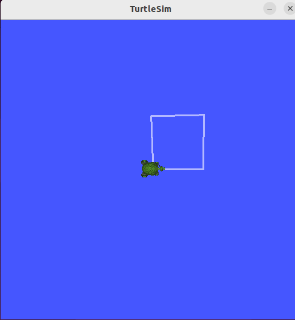

# ROS2 TurtleSim - Draw Square 🐢

This ROS2 package makes a turtle draw a square in the turtlesim simulator.

---



## Requirements

- Ubuntu 22.04  
- ROS2 Humble  
- turtlesim package  

---

## Setup & Usage

```bash
# Source ROS2
source /opt/ros/humble/setup.bash

# Install turtlesim
sudo apt update
sudo apt install ros-humble-turtlesim

# Clone and build the package
cd ~/turtle_s_ws/src
git clone https://github.com/2saleh1/ros2-turtle-square.git
cd ..
colcon build
source install/setup.bash

# Start turtlesim (in a new terminal)
ros2 run turtlesim turtlesim_node

# Run the square node (in another terminal)
source ~/turtle_s_ws/install/setup.bash
ros2 run ros2_turtle_square turtle_square